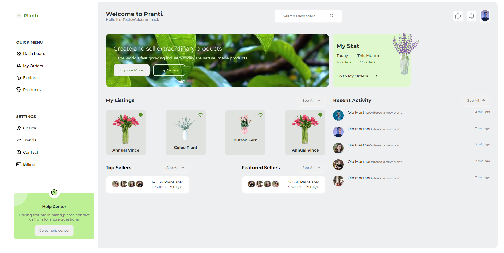

# PlantDashboard

Este proyecto fue creado con React y está diseñado para ser una página web con animaciones y efectos visuales atractivos. Además, está diseñada para ser responsiva y se puede adaptar a cualquier dispositivo. Se utilizó el preprocesador CSS SCSS y TailwindCSS para los estilos, y React Icon para las animaciones.

## Tecnologías principales

-  React
-  Tailwind

## Capturas de pantalla

## Créditos

Este proyecto fue creado a partir de un video tutorial en YouTube del canal [IsraTech](https://www.youtube.com/@IsraTech1) (https://www.youtube.com/watch?v=ALyO4vA7sKU&t=14s).

## Link

Puedes ver el sitio en vivo en el siguiente enlace: [Live site URL](https://todo-app-yha.netlify.app/)
